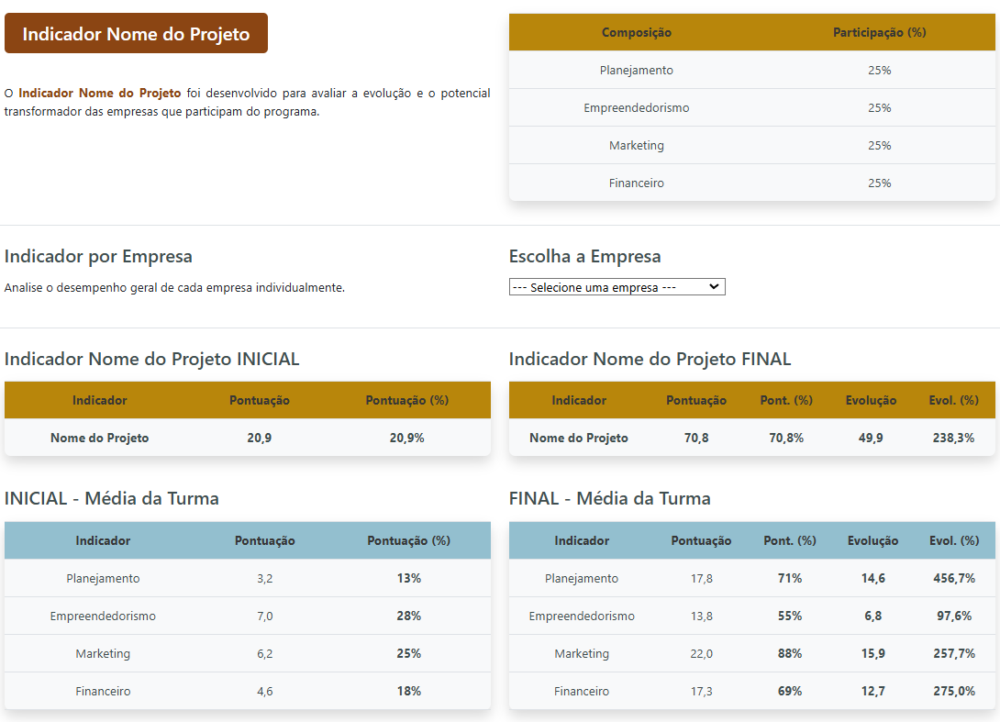
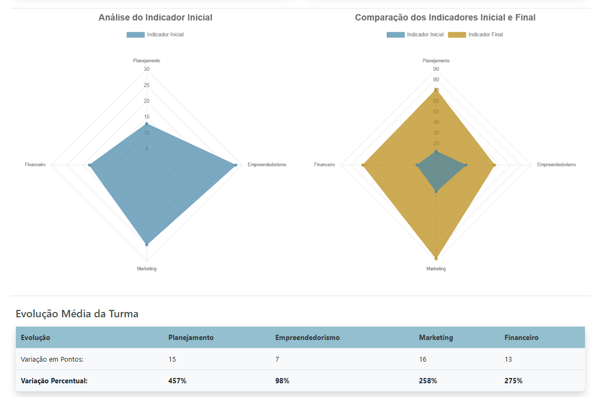
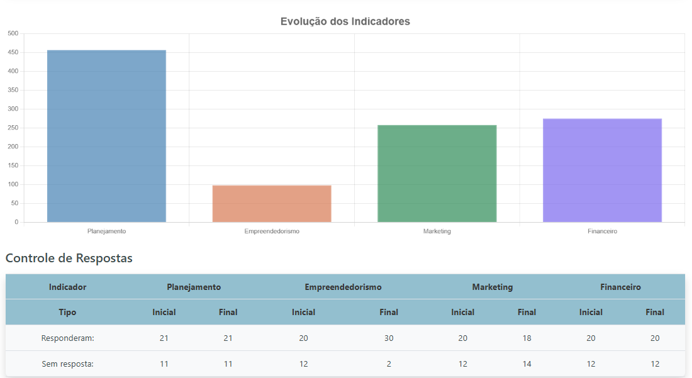

# 📊 KPI Methodology - Provento-Manager

The **Provento-Manager** system provides a structured methodology to assess **business progress** and **facilitator performance** within an acceleration program. This document outlines the **key performance indicators (KPIs)**, calculation methods, and customization options.

---

## 📌 1. Objective of the Indicators

The system's KPIs serve two primary purposes:

1️⃣ **Monitor the evolution of companies** throughout the acceleration program.  
2️⃣ **Track facilitator engagement** to ensure active participation in mentorship activities.  

The indicators are **adaptable** to the specific needs of each project, providing flexibility in assessment criteria.

---

## 📌 2. Key Performance Indicators (KPIs)

### **1️⃣ Business Progress KPI**  
- Measures the **initial vs. final performance** of companies in the program.  
- Evaluates **four key areas**:  
  - **📊 Planning** → Strategic and organizational capacity.  
  - **🚀 Entrepreneurship** → Innovation and business model development.  
  - **📣 Marketing** → Branding, communication, and market positioning.  
  - **💰 Financial** → Sustainability, profitability, and financial management.  
- The **final indicator weight** can be adjusted according to the **project’s objectives** and the **maturity level of participating companies** (ideation vs. operational stage).  
- Each **individual indicator** (Planning, Entrepreneurship, Marketing, Financial) can also have different weightings **tailored to the project’s needs**.

### **2️⃣ Facilitator Participation KPI**  
- Tracks **whether mentors and consultants have completed evaluation forms** with their assigned companies.  
- Ensures accountability and engagement in the acceleration process.  
- Can highlight **gaps in participation** and suggest improvements.  

### **3️⃣ Company Engagement KPI**  
- Measures the **number of interactions** between companies and facilitators.  
- Identifies whether **higher engagement correlates with better performance** in other KPIs.  
- Helps project managers analyze **company responsiveness and participation**.  

---

## 📌 3. Calculation Methodology  

- **Scoring System**  
  - Each company is assessed based on the **four key indicators** (Planning, Entrepreneurship, Marketing, and Financial).  
  - Scores are assigned based on a **structured questionnaire**, where each question can have **different weightings** depending on the project requirements.  
  - The **final score** is calculated as a **weighted sum of the individual indicators**.  

- **Weight Adjustments & Customization**  
  - The final indicator can be **weighted differently** depending on what the **project manager wants to measure**.  
  - Each question within an individual indicator can also have **custom weightings**, making the evaluation **fully adaptable** to the needs of different acceleration programs.  
  - If a project requires special adjustments, this **involves a consulting process** to define the most appropriate evaluation framework.  

---

## 📌 4. Indicator Visualization  

📊 The **Provento-Manager** system provides real-time **automated dashboards** to visualize business progress and facilitator engagement.  

✅ **General Project Indicator** → Overall performance overview.  
✅ **Company-Specific Dashboard** → Individual company progress tracking.  
✅ **Individual Indicator Analysis** → Breakdown of Planning, Entrepreneurship, Marketing, and Financial aspects.  

### **1. General Project Indicator**
  
*This visualization provides an overview of the project's key performance indicators (KPIs). It summarizes the evolution of participating companies based on pre-defined criteria.*

### **2. Initial vs. Final Indicator Comparison**
  
*This radar chart compares the initial and final performance of companies in the acceleration program. It highlights growth in key areas such as Planning, Entrepreneurship, Marketing, and Financial management.*

### **3. Average Progress of the Cohort**
  
*This chart displays the average improvement of companies throughout the program. It helps project managers assess the overall effectiveness of the acceleration initiative.*

🔎 **Want to explore the project in action?**  
📩 **Contact us for access and insights!**  

---

📌 **Important Note**:  
The **Provento-Manager** system is developed entirely in **Portuguese** to serve its target audience.  
However, documentation and explanations are available in **English** for international understanding.  

---

This document serves as a **framework** for understanding how business progress and facilitator engagement are measured in the **Provento-Manager** system. 🚀  

If you have specific **project needs**, our methodology can be fully customized to ensure accurate and relevant performance tracking.  

---
